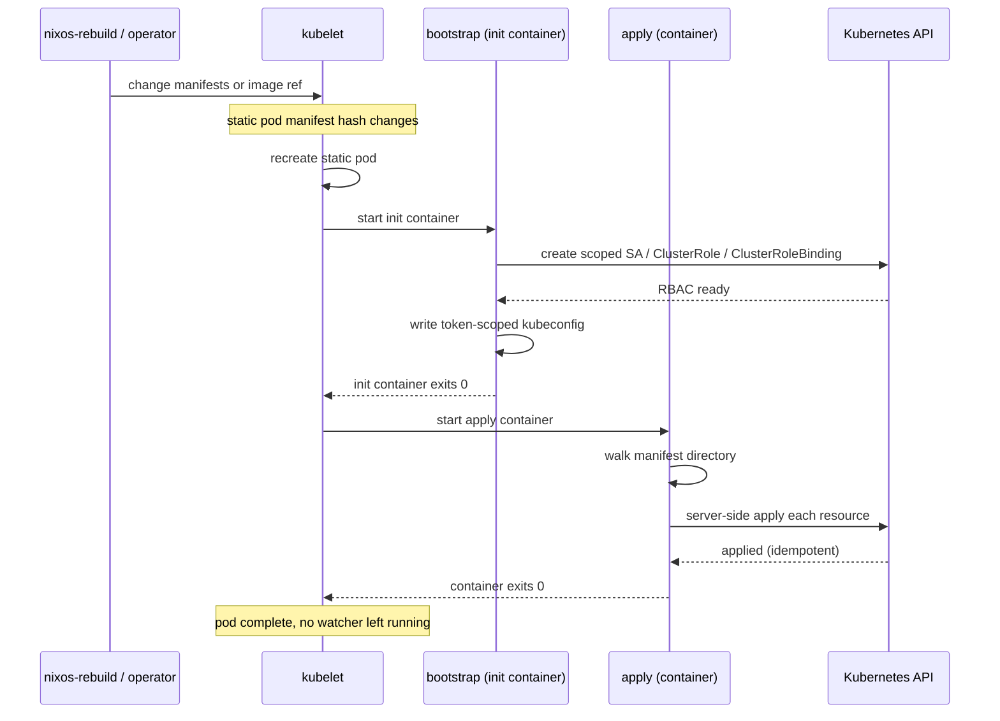

# inoculant

[](https://github.com/UnstoppableMango/inoculant/actions/workflows/ci.yml)
[](https://pkg.go.dev/github.com/unstoppablemango/inoculant)
[](LICENSE)
[](https://nixos.org)
[](https://github.com/UnstoppableMango/inoculant/commits/main)

A one-shot Kubernetes bootstrapping tool.
It applies static resources to a cluster and exits.
Distribution-agnostic: works against any cluster reachable via kubeconfig.

Early development (v0.0.1). See [GOALS.md](GOALS.md) for full rationale.

## What it does

1. Runs as a kubelet static pod with two containers: `bootstrap` (init) and `apply`.
2. `bootstrap` creates scoped RBAC (ServiceAccount, ClusterRole, ClusterRoleBinding) limited to a set of allowed GVKs, then writes a token-scoped kubeconfig for the `apply` container.
3. `apply` walks a manifest directory (YAML/JSON) and server-side applies each resource to the cluster.
4. The pod exits. No watcher, no ongoing reconciliation.

Re-applying is driven by kubelet itself: it derives a static pod's identity from a hash of its manifest file, so changing manifest content or the inoculant image both trigger a fresh run.

## Lifecycle



## Commands

```bash
make build      # nix build .#
make container  # OCI archive → bin/inoculant.tar (nix2container + skopeo)
make test       # ginkgo run -r
make lint       # nix flake check
make fmt        # nix fmt
make tidy       # go mod tidy + regenerate nix/gomod2nix.toml
make update     # nix flake update
```

Dev shell: `nix develop` (provides Go, gopls, ginkgo, gomod2nix, formatters).

## Status

v1 scope: raw manifest directories + scoped bootstrap RBAC.
Post-v1: Helm (OCI), Kustomize, apply-set pruning.
Non-goals: multi-cluster, secret management, dependency ordering, ongoing drift reconciliation.
